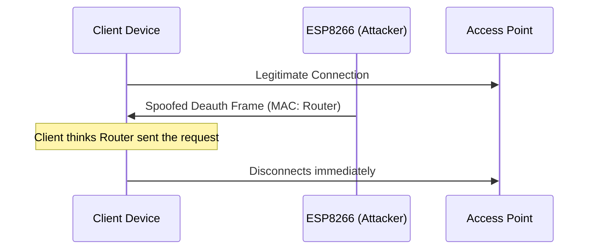

  

**An educational project to understand WiFi security and the 802.11 deauthentication vulnerability.**

## ⚠️ Disclaimer
**This project is intended for educational purposes and testing on your OWN networks only.**
Using this tool on networks you do not own or have permission to test is **illegal** and constitutes a Denial of Service (DoS) attack. The author takes no responsibility for any misuse of this information.

---

## 🧐 What is this?
This project uses an **ESP8266** development board (NodeMCU) to run the open-source [Deauther firmware](https://github.com/SpacehuhnTech/esp8266_deauther) created by Spacehuhn.

Many people confuse this tool with a "WiFi Jammer," but it is actually a **Deauthentication Tool**.
* **Jammer:** Creates noise on the 2.4GHz spectrum to physically block signals (Illegal).
* **Deauther:** Sends specific WiFi management packets (frames) that tell a device to disconnect from a router.

This tool demonstrates a flaw in the older 802.11 WiFi standard where these "management frames" are not encrypted, allowing anyone to spoof them.

## 🛠️ Hardware Used
* **Microcontroller:** NodeMCU (ESP8266) / Wemos D1 Mini
* **Cable:** Micro-USB Data Cable
* **Computer:** Windows PC (for flashing)

## ⚡ How It Works (Protocol Diagram)

*The ESP8266 monitors Wi‑Fi traffic, imitates the router’s MAC address, and injects a deauthentication frame.*

---

## 📥 Installation Guide
To replicate this project, follow these steps:

### Step 1: Drivers
Ensure your computer can talk to the ESP8266. You likely need one of these drivers:
* **CP2102** (for square chips)
* **CH340** (for rectangular chips)

### Step 2: Flashing Firmware
The easiest method is using the web installer:
1.  Connect the ESP8266 to the PC.
2.  Go to [esp.deauther.com](https://esp.deauther.com).
3.  Click **Connect** and select the correct COM port.
4.  Click **Install Deauther**.

## 🎮 How to Use
1.  Power up the ESP8266.
2.  Connect your phone/PC to the WiFi network named **`pwned`** (Password: `deauther`).
3.  Open a browser and go to `192.168.4.1`.
4.  **Scan** for networks.
5.  **Select** your own test network.
6.  Go to the **Attack** tab and start the "Deauth" attack.

   ##images
   
   

## 🛡️ How to Protect Yourself
The only way to stop this attack is to use the **802.11w** standard (Protected Management Frames).
* Most modern routers have this feature, but it is often disabled by default to support older devices.
* If 802.11w is enabled, the device will ignore the fake disconnect packets because they are not properly signed by the router.
  
## ❓ FAQ & Troubleshooting (Collapsible)

Why does the ESP8266 keep resetting?

Ensure you have a stable 3.3 V supply and that the **CH340/CP2102** driver is correctly installed. Try a different USB cable.

My computer does not see a COM port.

Install the appropriate driver for your USB‑to‑UART chip (CP2102 for square chips, CH340 for rectangular chips). Re‑plug the board after driver installation.

Can I target WPA‑protected networks?

The deauth attack works on any network that uses **unencrypted management frames** (most WPA/WPA2). Enabling **802.11w (PMF)** on the router mitigates this.

---

* **Project Documentation:** SHEHAN N WEERASINGHE 

---
*Created for educational exploration of cybersecurity concepts.*
